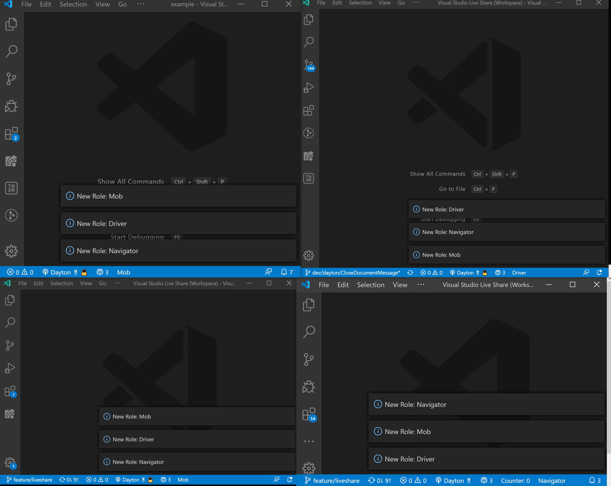

# PairIt
**PairIt** is an extension to facilitate pair and mob programming sessions over Live Share. 

In its current version, it simply assigns and dynamically updates the roles of users in a mob programming session.

## Roles
There are three distinct roles:
- *Driver*. Responsible for actually writing code.
- *Navigator*. Makes decisions about what to do and directs the driver.
- *Mob*. Passive observer.

There should be one driver, one navigator, and the remainder of the participants are part of the mob.

## Role Updates
There are three situations that cause a participant's role to change:
- *On schedule*. Every four minutes roles are rotated.
- *Leave*. If the driver or the navigator leaves the session, another participant will assume their role.
- *Join*. When someone first joins a session, they are assigned a role.

## Extension Design
Like most Live Share extensions, the host is the source of truth. The host maintains a list of all participants in the session and their roles and keeps track of time. Anytime a participant needs to be assigned a new role (see [Role Updates](#role-updates)), the host will send a notification to all guests. This notification contains a map from client id to role. Guests will look up their role from this map and update their role. Anytime your role is changed, you'll receive a notification. Your role is displayed in the status bar at all times.

## Development
`yarn install`

`npm run compile`

F5